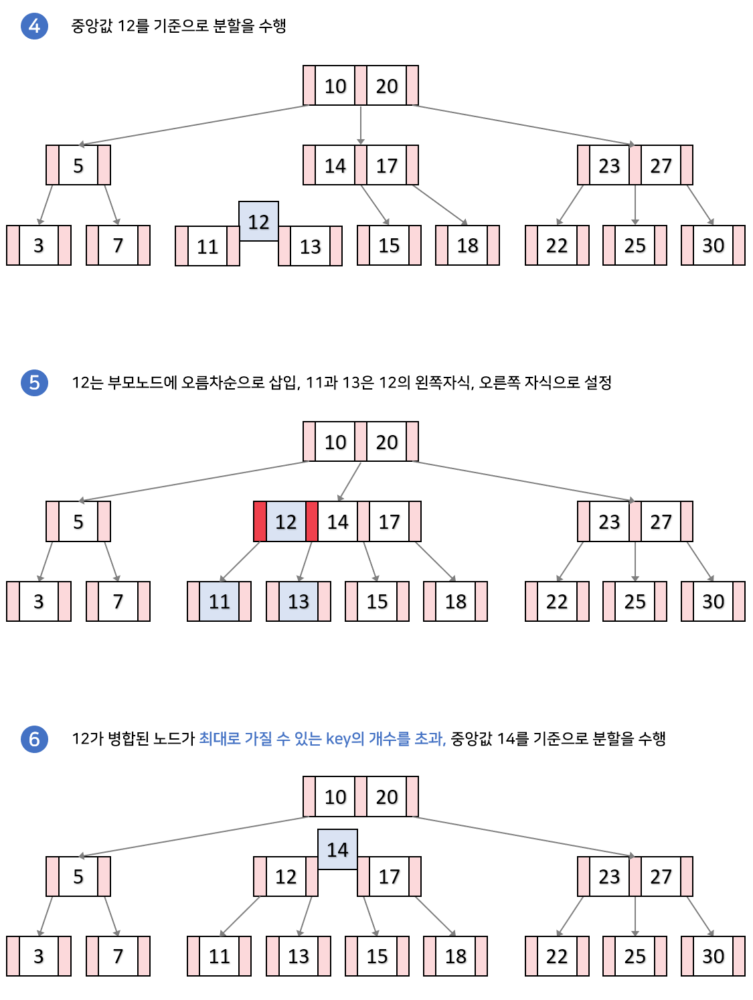
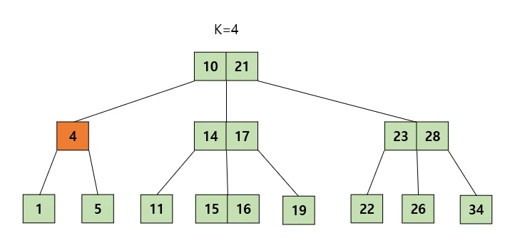

# B Tree

## B Tree
- Balanced Tree 종류 중 하나
- B 트리는 트리 자료구조의 일종으로 이진트리를 확장해 하나의 노드가 가질 수 있는 자식 노드의 최대 숫자가 2보다 큰 트리 구조
- 내부 노드는 ceil(M/2) ~ M개의 자식을 가질 수 있다. 최대 M개의 자식을 가질 수 있는 B 트리를 M차 B트리

- 특정 노드의 데이터(key)가 K개라면, 자식 노드의 개수는 K+1개여야 한다.

- 특정 노드의 왼쪽 서브 트리는 특정 노드의 key 보다 작은 값들로, 오른쪽 서브 트리는 큰 값들로 구성된다.
- 노드 내에 데이터는 ceil(M/2)-1개부터 최대 M-1개까지 포함될 수 있다.

- 모든 리프 노드들이 같은 레벨에 존재한다.

- Database 엔진에 많이 사용되며 범위 쿼리 최적화, 디스크 I/O 최소화를 위해 B+Tree를 사용하기도 합니다.
  - 브라우저에서 사용하는 IndexedDB, IOS와 Android에서 사용하는 SQLite, 또는 MySQL, PostgreSQL와 같은 데이터 베이스에서 Index를 위하여 사용됩니다.

- 다만 블록체인에서는 주로 데이터 추가하는 방식이며 무결성과 신뢰성을 보장하기에 Merkle Tree를 주로 사용합니다.

## 삽입

## 탐색

## 삭제
### 리프 노드에서 삭제
1. 리프 노드에서 값을 삭제하더라도 최소 유지 개수 조건을 만족하는 경우

2. 리프 노드에서 값을 삭제할 때, 최소 유지 개수를 만족하지 못하지만 바로 옆 형제 노드들에게 값을 빌려올 수 있는 경우

3. 리프 노드에서 값을 삭제할 때, 최소 유지 개수를 만족하지 못하고 형제 노드들에게 값을 빌려올 수 없지만, 부모 노드를 분할할 수 있을 때

4. 리프 노드에서 값을 삭제할 때, 최소 유지 개수를 만족하지 못하고, 형제 노드들에게 값을 빌려올 수 없고 부모 노드도 분할할 수 없을 때
- 리프 노드가 아닌 내부 노드에서 삭제에서 2번과 동일

### 리프 노드가 아닌 내부 노드에서 삭제
1. 내부 노드에서 값을 삭제할 때, 현재 노드 혹은 자식 노드의 최소 유지 개수의 최소보다 큰 경우

2. 내부 노드에서 값을 삭제할 때, 현재 노드와 자식 노드 모두 key 개수가 최소인 경우

## Reference
- https://github.com/google/btree/tree/master
- https://velog.io/@chanyoung1998/B%ED%8A%B8%EB%A6%AC
- https://code-lab1.com/b-tree/
- https://velog.io/@emplam27/%EC%9E%90%EB%A3%8C%EA%B5%AC%EC%A1%B0-%EA%B7%B8%EB%A6%BC%EC%9C%BC%EB%A1%9C-%EC%95%8C%EC%95%84%EB%B3%B4%EB%8A%94-B-Plus-Tree
